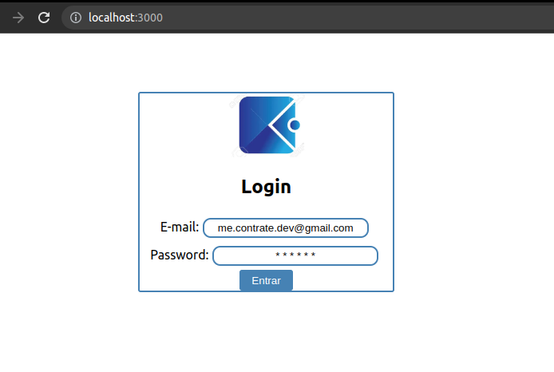
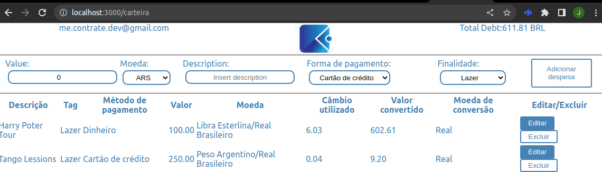
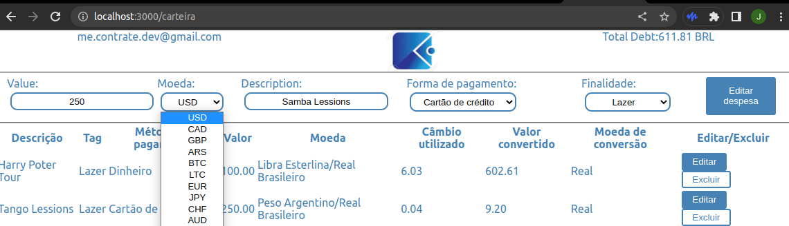

# DigiWallet

A experimental front-end React-Redux interface to manage expances in several currencies, including criptos, using real time convertion rates.

The files enlisted in this repository were fully developed by @Jvieyrah amd to run them in your machine make sure you have the latest version of Node JS installed at your machine, alonsside with react and redux.

Before start - enter the clonned repositoryand instal it's the dependencies by typing on your terminal: npm install
once installed typy 'npm start' at your terminal to run it on your browser.

Insert any valid e-mail and a six digit password ( for displaying reasions it does require an actual account).

The feel free to insert expanses, choose payment methods and currencies, it will convert total amount to BRL in real time.

You will be able do edit and delete expanses at your discretion sing the buttons edit/delet.

For privacy reasions, although it fetches currency rates from brazilian central bank's api it does not send your info to any external server, everything is kept safe at your local machine using redux to store your info.
